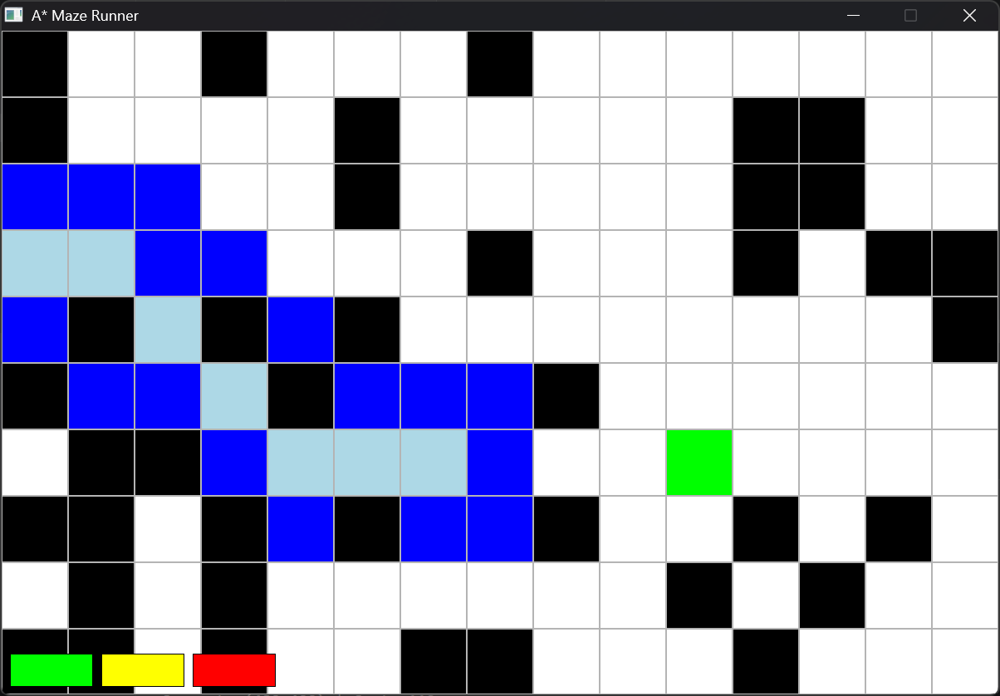
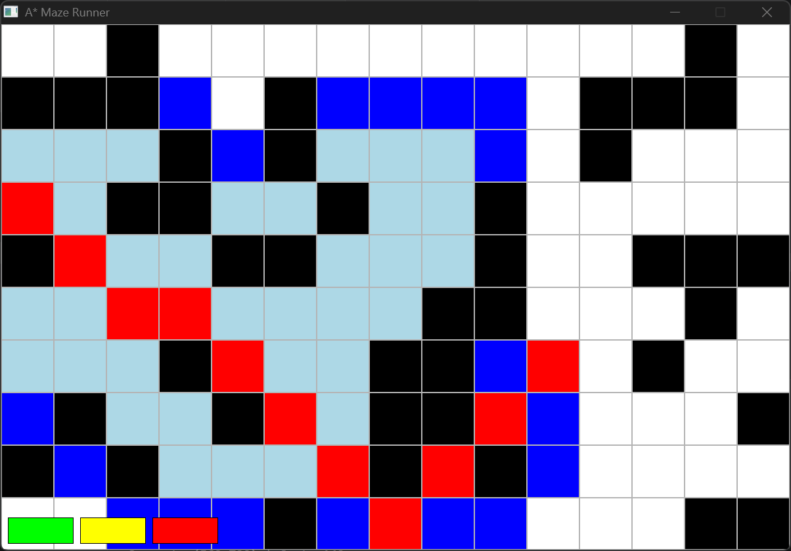

# 🧠 Visualiseur A* (SDL3)

Ce projet est un **visualiseur de l’algorithme A*** écrit en **C avec SDL3**.
Il génère une grille aléatoire avec des obstacles, exécute automatiquement A* pour trouver un chemin, puis affiche le résultat.





---

## 🚀 Fonctionnalités

* Génération aléatoire d’une grille (avec murs)
* Implémentation de l’algorithme A*
* Résolution automatique du chemin
* Visualisation en temps réel avec SDL3
* États visuels des cellules :

  * **ROAD** → case libre
  * **WALL** → obstacle
  * **ADDED** → nœuds à explorer (open list)
  * **TRAVELED** → nœuds déjà explorés
  * **PATH** → chemin final trouvé
  * **GOAL** → objectif

---

## 🧠 Algorithme A*

Chaque cellule contient :

* `gCost` → coût depuis le départ
* `hCost` → estimation vers l’objectif (heuristique)
* `fCost = g + h`

### Étapes :

1. Ajouter le point de départ à la liste ouverte
2. Choisir le nœud avec le plus petit `fCost`
3. Explorer ses voisins
4. Mettre à jour leurs coûts et leur parent
5. Répéter jusqu’à atteindre l’objectif
6. Reconstruire le chemin en remontant les parents

---

## ⚙️ Compilation et exécution

### Prérequis

* GCC
* SDL3

### Compiler

```bash
make
```

### Lancer

```bash
./main
```

---

## 🎮 Utilisation

* Aucune interaction utilisateur
* Le programme :

  1. Génère une grille aléatoire
  2. Exécute automatiquement A*
  3. Affiche le résultat
  4. Se ferme une fois terminé

---

## 🎨 Visualisation

| Type     | Description  |
| -------- | ------------ |
| ROAD     | Case vide    |
| WALL     | Mur          |
| ADDED    | À explorer   |
| TRAVELED | Déjà exploré |
| PATH     | Chemin final |
| GOAL     | Objectif     |

---

## ⚠️ Détails techniques

* Indexation : `grid[y][x]`
* Position écran : `x * BLOCK_SIZE`, `y * BLOCK_SIZE`
* Coûts :

  * Horizontal/vertical = 10
  * Diagonal = 14
* Heuristique : distance de Manhattan

---

## 🧩 Améliorations possibles

* Ajouter des contrôles (clic pour avancer étape par étape)
* Placer les murs avec la souris
* Choisir le départ et l’arrivée dynamiquement
* Animation progressive (au lieu d’un calcul instantané)
* Affichage des coûts (`g`, `h`, `f`)
* Utiliser un tas (heap) pour optimiser la liste ouverte

---

## 🧑‍💻 Auteur

Samy — apprentissage des algorithmes, du C bas niveau et du rendu graphique.

---
